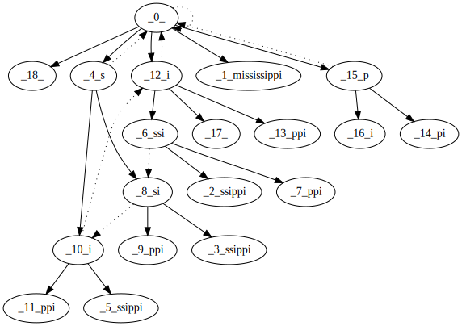

# Suffix Collections


[](LICENSE)
[](https://crates.io/crates/suff_collections)
[](https://docs.rs/suff_collections)

Fast realization of suffix array and suffix tree for substring search, longest common prefix array (lcp array).

## Unicode
The current implementation builds suffix structures using bytes and does not decode the string before or during construction in Unicode. But if Unicode string is [normalized](https://unicode.org/reports/tr15) before construction and search, then structures support Unicode (because all byte sequences are decoded unambiguously). Also search and lcp returns indexes as in byte array but not in Unicode decoded string.

## Example
* **SuffixTree**
```rust
     use suff_collections::{array::*, tree::*, lcp::*};

     // let word = "Some word";
     let word: &str = "Some word\0";
     let find: &str = "word";

     // construct suffix tree
     let st: SuffixTree = SuffixTree::new(word);

     // finds the entry position of the line 'find' in 'word'
     let res: Option<usize> = st.find(find);

     // construct lcp
     // lcp[i] = max_pref(sa[i], sa[i - 1]) && lcp.len() == sa.len()
     // let lcp: LCP<u8> = st.lcp_stack::<u8>();
     // let lcp: LCP<u16> = st.lcp_stack::<u16>();
     // let lcp: LCP<u32> = st.lcp_stack::<u32>();
     // let lcp: LCP<usize> = st.lcp_stack::<usize>();
     let lcp: LCP<usize> = st.lcp_rec::<usize>();

     // convert suffix tree to suffix array
     // let sa = SuffixArray::<u8>::from_stack(st);
     // let sa = SuffixArray::<u16>::from_stack(st);
     // let sa = SuffixArray::<u32>::from_stack(st);
     // let sa = SuffixArray::<usize>::from_stack(st);
     let sa = SuffixArray::<usize>::from_rec(st);

     let mut buff = String::new();
     SuffixTree::new("mississippi")
        .to_graphviz(&mut buff).unwrap();
     println!("{}", &buff);
```
SuffixTree for the word "mississippi"




* **SuffixArray**
```rust
     use suff_collections::{array::*, tree::*, lcp::*};

     // let word = "Some word";
     let word: &str = "Some word\0";
     let find: &str = "word";

     // construct suffix array
     // let sa = SuffixArray::<usize>::new_stack(word);
     // let sa = SuffixArray::<u8>::new(word);
     // let sa = SuffixArray::<u16>::new(word);
     // let sa = SuffixArray::<u32>::new(word);
     let sa = SuffixArray::<usize>::new(word);

     // construct lcp
     // lcp[i] = max_pref(sa[i], sa[i - 1]) && lcp.len() == sa.len()
     let lcp: LCP<usize> = sa.lcp();

     // finds the entry position of the line 'find' in 'word'
     // O(|find| * log(|word|))
     let res: Option<usize> = sa.find(find);

     // finds all the entry position of the line 'find' in 'word'
     // O(|find| * log(|word|))
     let res_all: &[usize] = sa.find_all(find);

     // finds the entry position of the line 'find' in 'word'
     // O(|word|)
     let res: Option<usize> = sa.find_big(&sa.lcp(), find);

     // finds all the entry position of the line 'find' in 'word'
     // O(|word|)
     let res_all: &[usize] = sa.find_all_big(&sa.lcp(), find);

     // convert suffix array to suffix tree
     let st = SuffixTree::from(sa);

     let word = "mississippi";
     let sa = SuffixArray::<u32>::new(word);
     let lcp = sa.lcp();
     println!("LCP    index    suffixe's");
     sa.iter().zip(lcp.iter()).for_each(|(&sa, &lcp)| {
            let suff = String::from_utf8(
                word.as_bytes()[sa as usize..]
                .iter().map(|&x|).collect::<Vec<_>>()
            ).unwrap();
            println!("{}    {}    {}", lcp, sa, suff);
         }
     );
```

SuffixArray and lcp for the word "mississippi"

```
LCP    index    suffixe's
0      11
0      10       i
1      7        ippi
1      4        issippi
4      1        ississippi
0      0        mississippi
0      9        pi
1      8        ppi
0      6        sippi
2      3        sissippi
1      5        ssippi
3      2        ssissippi
```

All construction and search work for O(n). For the suffix tree implementation the [Ukkonen algorithm][2] is taken and for the suffix array implementation the [SA-IS algorithm][1] is taken.

[1]: https://www.researchgate.net/profile/Daricks_Wai_Hong_Chan/publication/221577802_Linear_Suffix_Array_Construction_by_Almost_Pure_Induced-Sorting/links/00b495318a21ba484f000000/Linear-Suffix-Array-Construction-by-Almost-Pure-Induced-Sorting.pdf?origin=publication_detail

[2]: https://web.stanford.edu/~mjkay/gusfield.pdf
